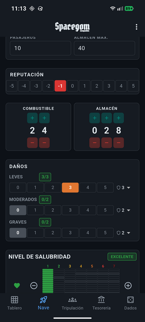
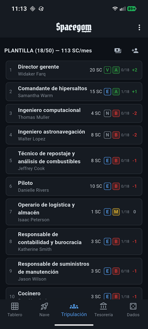

# Spacegom Companion


<p align="center">
  
</p>

App Android complementaria para [Spacegom](https://sites.google.com/view/spacegom/inicio), un librojuego de rol de mesa ambientado en el espacio.

Digitaliza las hojas de registro en papel del juego (ficha de compañía, tablero de cuadrantes, calendario de campaña, tesorería y hojas de área) en una app móvil.

## Capturas de pantalla

| Tablero | Nave | Tripulación |
|:---:|:---:|:---:|
|  |  |  |

| Tesorería | Calendario | Dados |
|:---:|:---:|:---:|
|  |  |  |

## Requisitos

- [Flutter SDK](https://docs.flutter.dev/get-started/install) (>= 3.9.2)
- Para Android: [Android Studio](https://developer.android.com/studio) con Android SDK (API 21+)
- Para iOS: [Xcode](https://developer.apple.com/xcode/) (solo en macOS)

## Instalación

Clona el repositorio e instala las dependencias:

```bash
git clone git@github.com:quiqueporta/spacegom.git
cd spacegom
flutter pub get
```

## Compilación

### Android

Conecta un dispositivo Android con la depuración USB activada o arranca un emulador, y ejecuta:

```bash
flutter run -d <device_id>
```

Para generar el APK de release:

```bash
flutter build apk --release
```

El APK se genera en `build/app/outputs/flutter-apk/app-release.apk`.

### iOS

> Requiere macOS con Xcode instalado.

```bash
cd ios && pod install && cd ..
flutter run -d <device_id>
```

Para generar el build de release:

```bash
flutter build ios --release
```

## Tests

```bash
flutter test
```

Para ejecutar un test específico:

```bash
flutter test test/models/employee_test.dart
```
