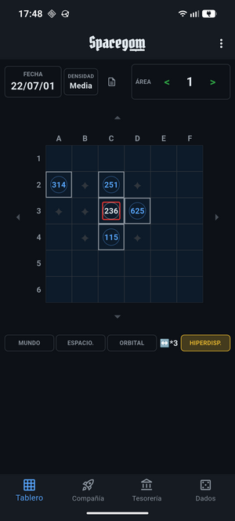
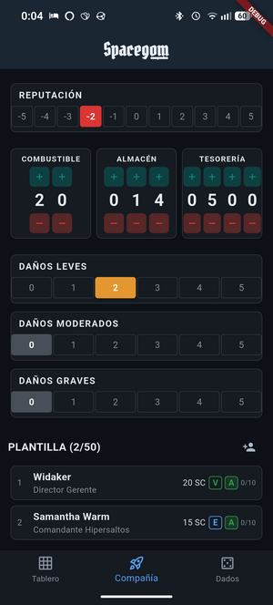
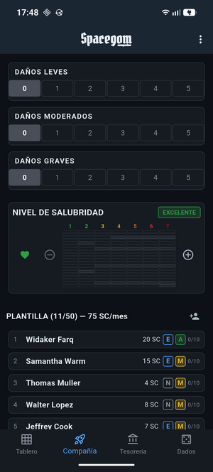
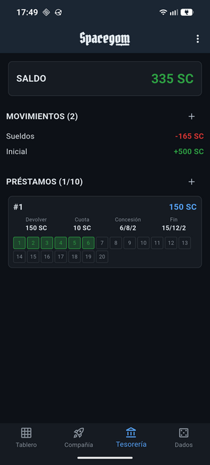
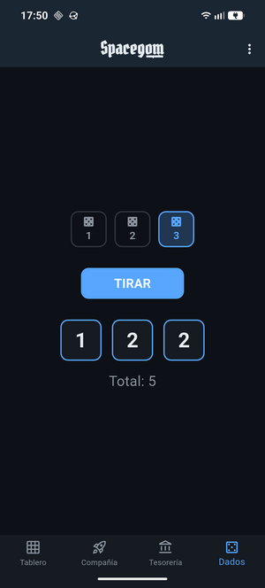
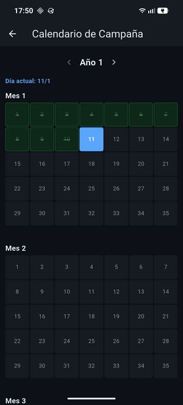

# Spacegom Companion


<p align="center">
  
</p>

App Android complementaria para [Spacegom](https://sites.google.com/view/spacegom/inicio), un librojuego de rol de mesa ambientado en el espacio.

Digitaliza las hojas de registro en papel del juego (ficha de compañía, tablero de cuadrantes, calendario de campaña, tesorería y hojas de área) en una app móvil.

## Capturas de pantalla

| Tablero | Compañía | Plantilla |
|:---:|:---:|:---:|
|  |  |  |

| Tesorería | Dados | Calendario |
|:---:|:---:|:---:|
|  |  |  |

## Requisitos

- Flutter SDK
- Dispositivo Android o emulador

## Desarrollo

```bash
flutter pub get
flutter test
flutter run -d <device_id>
```
